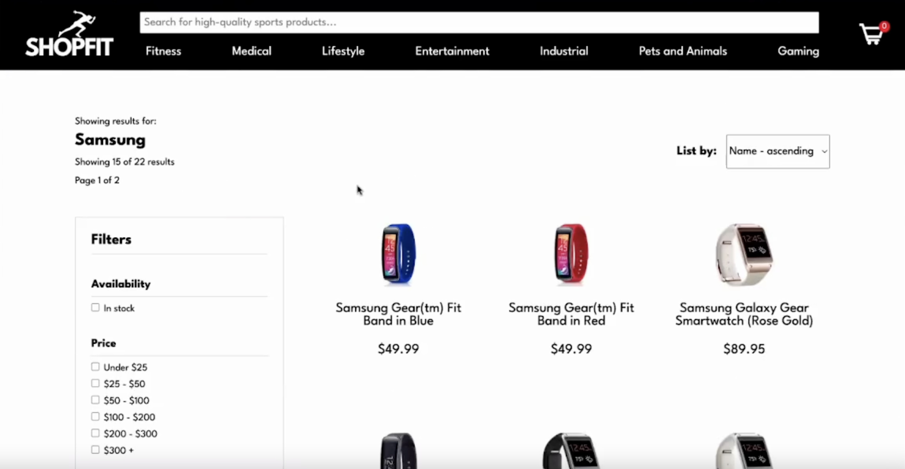

# Shopfit: An Electronic Gadgets E-Commerce Website

This was a project that I did with a partner as part of the Diploma of Full-Stack Web Development at Concordia University. We had 2 weeks to put together an full-stack e-commerce website, using React.js on the frontend, Node.js on the backend and MongoDB as the database.

Users are able to use a search bar to search products, as well as filter products based on price, category, body location and availability.

A full demo of the website is featured at the following link: https://www.youtube.com/watch?v=8Nyvra5WJ44&ab_channel=MatthewLangmuir

## Development

### Frontend
In the terminal, access client by running `cd client`. Then, run `yarn` and `yarn start`.

### Backend
Access directory by running `cd server`. Install `express`, `mongodb`, `nodemon` and `morgan`. Once dependencies installed, run proxy by running `nodemon`.

### Batch import to MongoDB
All products need to be imported to the database. In the server folder, run `node << drag batchImport.js file in here >>.

